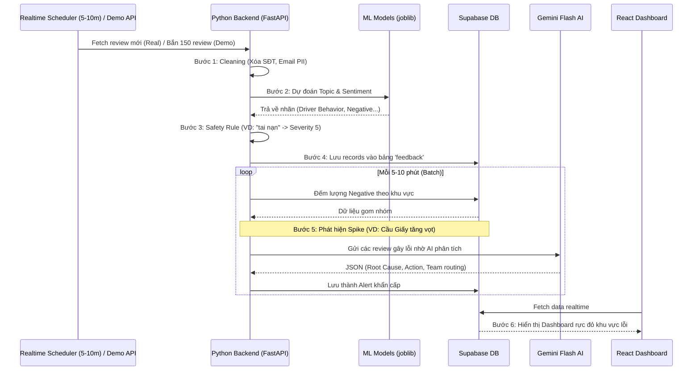

# MASTER BLUEPRINT: AI Quality Intelligence Platform (AI20K-223)
**Lĩnh vực:** Smart Mobility — Feedback Analytics | **Tech Stack:** React, FastAPI, Supabase, NLP, Gemini Flash

Bản tài liệu này là Thiết kế Thi công Tổng thể (Master Blueprint). Nó tổng hợp toàn bộ bài toán thực tế, khoá chặt phạm vi sản phẩm (MVP), và phác thảo một lộ trình 4 tuần chi tiết đến từng file code.

---

## 1. Phân Tích User Pain Points (Nỗi đau của người dùng)

| Chân dung User | Pain Point (Vấn đề) | Giải pháp của hệ thống (Tính năng) |
| :--- | :--- | :--- |
| **Quản lý Vận hành (Ops)** | Đọc báo cáo thủ công quá chậm, thường chỉ biết đến khủng hoảng khi nó đã bùng phát mạng xã hội. | **Dashboard & Spike Detection:** Tự động phát hiện và cảnh báo các khu vực có tỷ lệ phàn nàn tăng vọt trong thời gian thực. |
| **Đội An toàn (Safety)** | Dễ bị sót các phản hồi nghiêm trọng như "tài xế say xỉn", "tai nạn" giữa hàng ngàn review rác. | **Rule-based Classification:** Bất kỳ phản hồi nào có keyword an toàn lập tức bị ép Severity 5 (Đỏ) và báo động Alert P1. |
| **Đội CSKH (CS Team)** | Nhận luồng ticket khổng lồ, không biết ưu tiên xử lý cái nào trước, mất thời gian tự tóm tắt vấn đề. | **Agentic Routing:** AI (Gemini) gom các phản hồi lỗi $\to$ Sinh báo cáo nguyên nhân lõi $\to$ Giao thẳng ticket cho đúng Team kèm SLA. |
| **Đội IT / Product** | Khó theo dõi kịp thời các lỗi kỹ thuật (app lag, crash, lỗi GPS) ngay sau các đợt cập nhật app. | **Topic "App Issue":** Phân loại và nhóm riêng các phàn nàn về kỹ thuật, định vị khu vực lỗi để IT fix bug khẩn cấp. |
| **Đội Định giá (Pricing)** | Phản ứng chậm khi bị phàn nàn giá cước tăng vọt vô lý (surge pricing), giá ảo $\to$ khách lùi app đối thủ. | **Topic "Pricing":** Theo dõi cảm xúc tiêu cực của khách về cước phí, gửi insight để đội Pricing điều chỉnh thuật toán. |

---

## 2. Luồng Xử Lý End-to-End (Quy trình khép kín)

Hệ thống được thiết kế linh hoạt với **2 chế độ chạy**:
1. **Production (Môi trường thật):** Một Cronjob/Scheduler chạy tự động mỗi 5-10 phút để hút đánh giá mới từ Internet mang về phân tích.
2. **Demo Day (Bảo vệ dự án):** Cung cấp một API đặc biệt bắn 150 phản hồi giả lập cùng lúc vào hệ thống để "ép" hệ thống kích hoạt báo động khẩn cấp ngay trên sân khấu.

---

## 3. Phạm Vi Sản Phẩm MVP (MVP Scope)

**✅ NHỮNG GÌ CHẮC CHẮN LÀM (IN SCOPE):**
1. **Kiến trúc Cloud:** Triển khai 100% online (Vercel cho Frontend, Railway cho Backend, Supabase cho Database).
2. **Auth & Roles:** Đăng nhập, đăng ký an toàn.
3. **Data Pipeline Dual-Mode:** Python Script chạy tự động (5-10 phút) và Endpoint phục vụ Demo 150 reviews.
4. **NLP Processing:** Dùng 2 model `.joblib` có sẵn để gán nhãn Topic/Sentiment kết hợp Rule-based (từ khoá).
5. **Agentic AI:** Script tự động gom review lỗi $\to$ Gemini Flash $\to$ Định tuyến Alert $\to$ DB.
6. **Frontend 3 Màn hình:** `Dashboard` (Trend, Heatmap), `Alerts` (Cảnh báo sự cố), `Feedback List` (Có nút sửa nhãn - Vòng lặp Human Review).

**❌ NHỮNG GÌ KHÔNG LÀM (OUT OF SCOPE):**
1. Không code hệ thống streaming data phức tạp (như Kafka). Dùng kiến trúc Batch (5-10 phút) thông qua Scheduler.
2. Không train lại mô hình NLP từ số 0. Tái sử dụng `.joblib` trong `xanh_iu`.
3. Chưa tích hợp App thật của tài xế.

---

## 4. Kế Hoạch Lập Trình Chi Tiết (4-Week Sprint)

### Tuần 1: Cấu trúc hạ tầng & Đưa dự án lên Cloud
*Mục tiêu: Đập tan rủi ro Deployment. Web phải truy cập được trên internet bằng URL thật.*
- Áp dụng file `.sql` có sẵn lên Supabase Cloud để tạo 4 bảng.
- Thay đổi `supabase.ts` để kết nối DB. Push lên GitHub $\to$ **Deploy Vercel**. Kiểm tra luồng Đăng nhập (Auth).
- Tạo API gốc bằng **FastAPI** (`main.py`). Cấu hình `requirements.txt` $\to$ **Deploy Railway/Render**.

### Tuần 2: Xây dựng Não trái (Data Pipeline & NLP)
*Mục tiêu: Dữ liệu thô đi vào $\to$ Dữ liệu sạch có nhãn AI đi ra.*
- `pipeline/clean.py`: Viết regex giấu PII (SĐT, Email).
- `pipeline/classifier.py`: Load `.joblib` models. Viết hàm Rule-based (VD: chứa từ "tai nạn" $\to$ return severity 5).
- `pipeline/ingest.py`: Thiết kế luồng Production (APScheduler 5-10p) và Demo (API trigger 150 JSON). Ghi dữ liệu vào Supabase.

### Tuần 3: Xây dựng Não phải (Spike Detection & Gemini Agent)
*Mục tiêu: Hệ thống tự phát hiện "biến" và AI tự động phân luồng phòng ban.*
- `pipeline/spike_detector.py`: Truy vấn đếm `Negative` feedback group by `area` trong 1h. Nếu vượt baseline $\to$ Ghi nhận Spike (VD: Bắt dính Spike ở `HN-Cau-Giay`).
- `pipeline/llm_agent.py`: Ném tập feedback lỗi vào prompt Gemini Flash $\to$ Sinh Alert $\to$ Lưu vào Supabase.

### Tuần 4: Đánh bóng Front-end & Luyện Kịch Bản Demo
*Mục tiêu: Giao diện trực quan, chuyên nghiệp, vượt qua vòng nghiệm thu.*
- `src/pages/Dashboard.tsx`: Vẽ biểu đồ Recharts (Line Chart, Bar Chart).
- `src/pages/Alerts.tsx`: Render thẻ cảnh báo đỏ rực (P1). Click vào để đọc báo cáo của AI Gemini.
- `src/pages/Feedback.tsx`: Nơi nhân viên bấm nút **[Edit Label]** để sửa nhãn sai của AI $\to$ Update trực tiếp vào Supabase.
- Luyện kịch bản Demo: *Đứng trên bục $\to$ Bấm nút "Bắn 150 đánh giá" $\to$ Dashboard đỏ rực $\to$ Gemini sinh báo cáo gửi thẳng cho IT/Safety Team $\to$ Nhân viên Ops sửa lại 1 nhãn AI nhận diện nhầm.*
